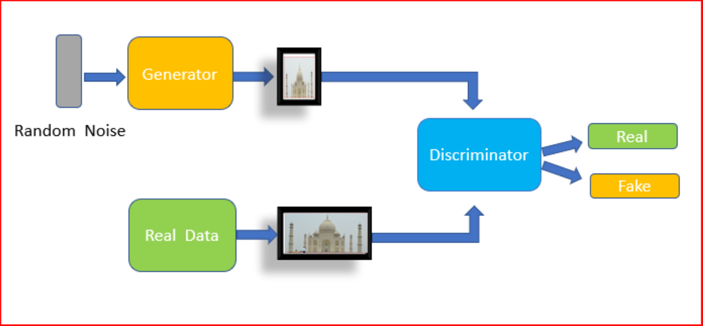
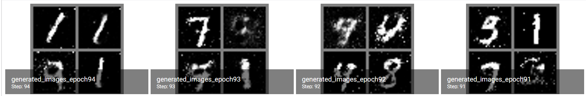
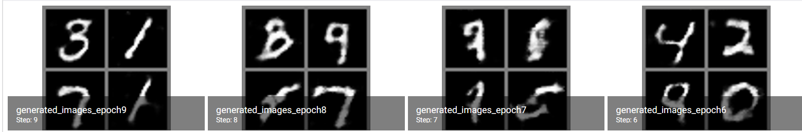
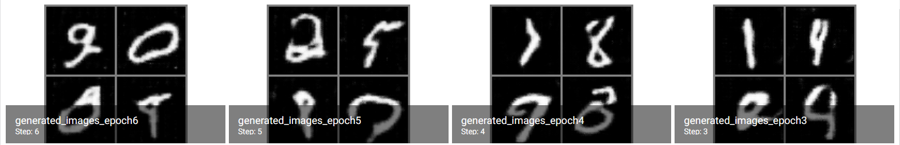
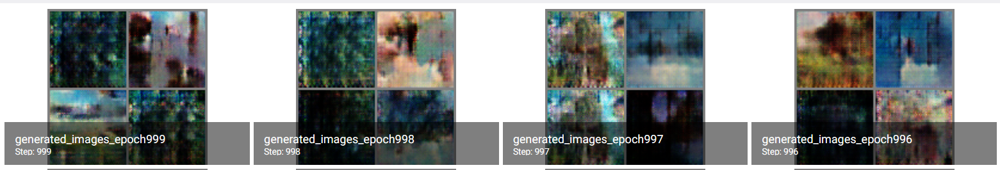
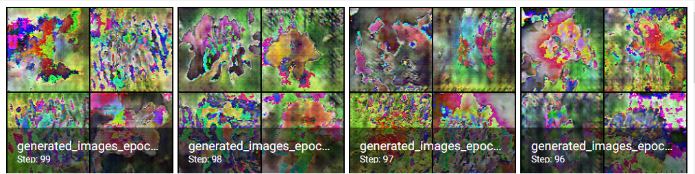
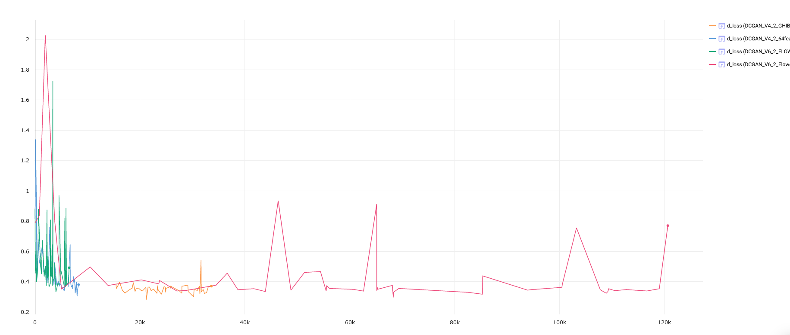
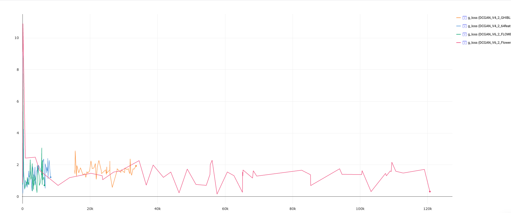

# GenerativeAdversialNetwork
> In this project I tried to get a Generative Adversial Network(short GAN) to work
> 

## Description of the Project
**Set up:**  
I used pytorch + pytorch lightning as framework. And used as Datasets MNIST (Number dataset), IRIS Flower dataset and a
custom GHIBLI dataset(Hand drawn landscape images from the company ghibli).

**Description:**  
I tried Generating Images which correspond to the dataset Images. For example when training the model with the
MNIST dataset i tried to generate Images which look like they have a numbers on them.

**Model:**  
I used different architectures for the models and played around with them.  
I used the **Generative Adversial Network (GAN)** architecture which consists of a multilayer perceptron(MLP) and has a Dicriminator which tries to
find fake Images and a Generator which tries to generate Images which look as real as possible in order to fool the Discriminator(See Image above).

I also used a **Deep Convolutional Generative Adversial Network(DCGAN)** which uses convolutional layer, which are also 
used in image classification, to improve th Realism of the Images.

I also experimentated with a **Conditional Deep Convolutional Generative Adversial Network(CDCGAN)** which not only uses the Image as data but 
also meta information such as label.

**Tricks:**  
I used various tricks such as:
-  _[Instance Noise](https://www.inference.vc/instance-noise-a-trick-for-stabilising-gan-training/)_  in order to get a "better" distribution.
-  Using _soft labels_
-  Adding experience Replay
-  For further trick check [here](https://github.com/soumith/ganhacks), [here](https://medium.com/@utk.is.here/keep-calm-and-train-a-gan-pitfalls-and-tips-on-training-generative-adversarial-networks-edd529764aa9) and [here](https://medium.com/intel-student-ambassadors/tips-on-training-your-gans-faster-and-achieve-better-results-9200354acaa5).  

**More Ressources:**
- [GAN paper](https://arxiv.org/abs/1406.2661)
- [DCGAN paper](https://arxiv.org/abs/1511.06434)
- [CGAN paper](https://arxiv.org/abs/1411.1784)
- [Pytorch tutorial DCGAN](https://pytorch.org/tutorials/beginner/dcgan_faces_tutorial.html)
- Internet

## Usage
1. Download the Jupyter Notebook files(`.ipynb`) you want to use for the corresponding model from the folder `code`.
2. Run it with Jupyter Notebook/Lab or Google Colab 

Notes:
- When using google colab all missing packages should be installed by itself.
- If you use juptyer notebook on a local machine you need to install the missing packages by yourself.
- Check Disclaimer

## Disclaimer
When I did the project a while ago my documentation wasn't very clear/clean. That lead to many different Jupyter Notebooks
where the only clue is what the difference between them is the name of the file and the code.

This means when choosing the Jupyter Notebook file to use, look at the file name and the code itself.

Not all Jupyter Notebook files will work on first try, some files might need some tinkering. Thats because: 
- some files dont train the model from scratch(Epoch 0) but load a model and contine training from a checkpoint(e.g. Epoch 50, Epoch 100).
You need to turn that off.  
=> to do that: comment `resume_from_checkpoint=""` out in `pl.Trainer()`.

- some Model train with  custom dataset which consist of GHIBLI Images (Hand drawn Movie Images)
To use that use a different dataset.  
=>To do that change the `train_dataloader` and `tesz_dataloader` function. When using a different Dataset be careful of **Image size**.

- The logger is comet_ml where I removed my api key.  
=> To fix that use you own comet_ml api key or a different logger.

- There could be other problem. I dont know of the top of my head :(

## Results
I could create good looking number images in different Image sizes such as 16x16, 32x32, 64x64 and 128x128 with using the MNIST dataset upscaled.
A problem was the flower dataset and the ghibli dataset, I couldnt get good looking pictures out of them. 

- [x] Standart MLP

- [x] DCGAN "standart"

- [x] DCGAN with "tricks"/"Opzimized"

- [x] DCGAN with Colored Landscape Images(Way more complicated than MNIST)(Image size: 64x64)

- [x] DCGAN with Flower Images and bigger Image size(128x128)

- **Dicriminator Losss**

- **Generator Losss**

If you want to see more results or losss graphics [click here](https://www.comet.ml/luposx#projects).

## Meta

Distributed under the MIT license. See ``LICENSE`` for more information.

[LICENSE Digit-Recognition](https://github.com/LuposX/BostonHousingPrediction/blob/master/LICENSE)

## Contributing

1.  Fork it (<https://github.com/LuposX/GenerativeAdversialNetwork/fork>)
2.  Create your feature branch (`git checkout -b feature/fooBar`)
3.  Commit your changes (`git commit -am 'Add some fooBar'`)
4.  Push to the branch (`git push origin feature/fooBar`)
5.  Create a new Pull Request
